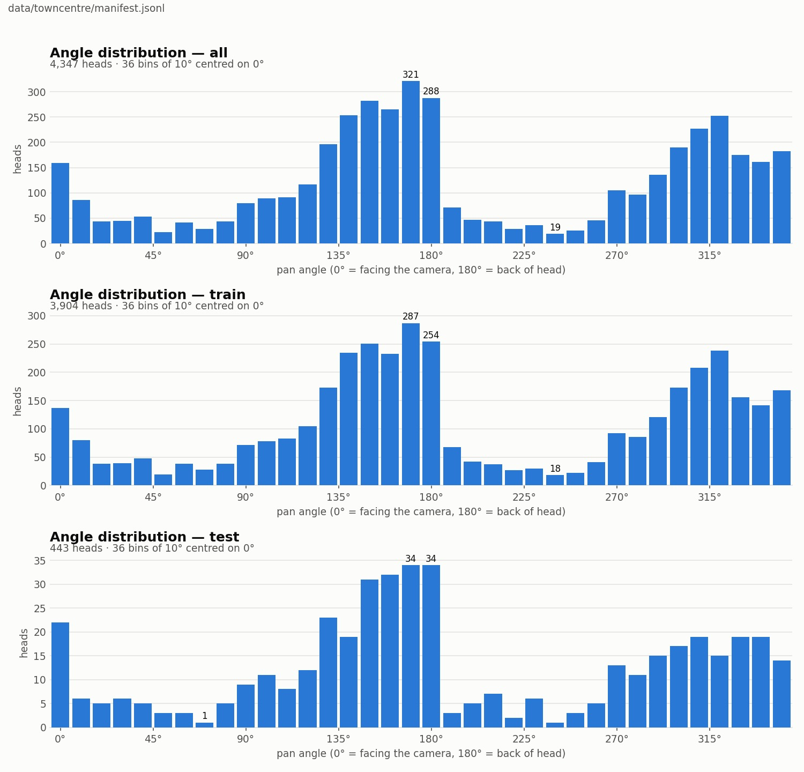
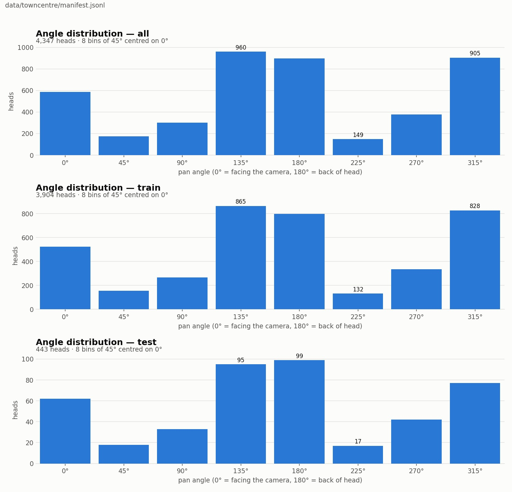

# 002: TownCentre dataset analysis

Created 2026-08-30 (user request: analyse what kind of dataset TownCentre is, while a training run was in
progress). Numbers come from `data/TownCentreHeadImages` (label files) and `data/towncentre/manifest.jsonl`;
figures from `scripts/plot_angle_distribution.py`.

## 1. Origin and structure

- Head crops from the Oxford TownCentre CCTV sequence (1920x1080, 25 fps) with pan-angle labels from
  Benfold & Reid, ICCV 2011 (paper reference [5]).
- Directory = person track id (2 260 dirs); file name `frame_person_x_y_a_b.jpg` with the frame coordinates.
- **480 189 jpg files, but only 4 734 label files** (`pan = ...`, `valid = 0/1`), i.e. one labelled frame per
  ~100 frames (4 s) per person. 387 are `valid = 0`; **4 347 valid heads of 1 758 persons** remain.
- The paper's "7 920 heads of 3 960 persons / 774 heads of 387 persons" counts flipped copies: 3 960 + 387 =
  4 347 = the valid count here. The person-level 90/10 split of this port gives 3 904 / 443 heads
  (1 573 / 185 persons, no overlap), so the setting is comparable.

## 2. Images

- Crop size median 29x28 px (17-59); size correlates with image row (corr 1.00, perspective).
- 94 % of crops are smaller than 46 px on a side, hence the 50x50 resize before cropping (001-B).
- At this resolution the cues are hair/skin/clothing colour and the head silhouette; facial features are not
  resolvable (`assets/002/samples_by_angle.png`, sorted by angle, label = degrees).

## 3. Labels

- Integer degrees, raw range -323..316, normalised as `(pan + 720) % 360`. 490 distinct values; 19.7 % are
  multiples of 5 (uniform would be 20 %), so the annotation is effectively continuous.
- Convention: 0 deg = facing the camera, 180 deg = back of the head, 90 / 270 deg = profiles.
- **Strongly bimodal** (8 bins of 45 deg centred on 0/45/...): `[586, 174, 300, 960, 897, 149, 376, 905]`.
  Pedestrians walk along the street towards or away from the camera; profiles (45 deg, 225 deg) are ~1/6 of the
  most frequent bin (test: 18 and 17 heads). Train and test shapes match.
- Label noise: angle change between consecutive labelled frames of the same person (4 s apart) has median 14 deg,
  90th percentile 61 deg, > 90 deg in 3.3 %. Sequences like 126 -> 115 -> 301 deg on one track suggest annotation
  swings of +-10-15 deg are common. The test floor is therefore probably around 20 deg MAAD.

## 4. Persons

- Labelled heads per person: median 2, max 12; 571 persons (32 %) have a single labelled head.
- Angular range within a person (>= 4 heads): median 54 deg.

## 5. Implications used later

- 443 test heads make single-epoch MAAD swing by +-3 deg at a constant lr (003).
- Only 1 % of the frames are labelled; neighbouring frames share the label to well under a degree (004-A).
- Profiles are rare; a per-bin MAAD breakdown would be the right diagnostic for augmentation work (004).
