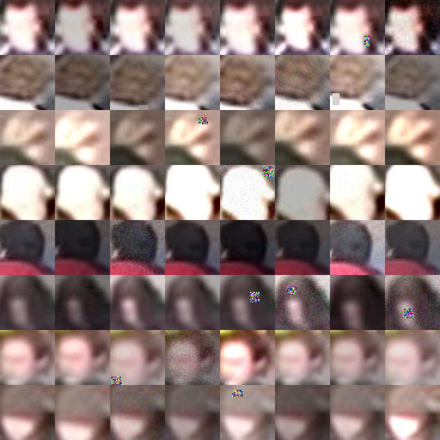

# 004: Augmentation ablation (neighbour frames / photometric / scale jitter)

Created 2026-08-30 (user request: implement augmentations 1-3 from the proposal, then run the ablation manually).
Implementation is done; the runs are executed by hand and the results section is filled in afterwards.

## 0. Motivation

003 §5: after 1000 + 100 epochs the training loss corresponds to ~7 deg while the test MAAD is 18.5 deg, with only
random crop + flip as augmentation. TownCentre (002) has 480 k frames of which 1 % are labelled, small blurry
crops, and label noise of the order of 10 deg. The candidates were screened against the augmentation code of
`High-Angle_Robust_Fast_FaceAlignment` (`src/hrffa/data/dataset.py`, `dataset/augment/geometric.py`): the
label-invariant photometric operations transfer, the 3D geometric ones (camera homography, depth reprojection,
generated images) do not apply to pan-only 28 px crops.

## 1. What was implemented

| # | Augmentation | Where | Switch |
|---|---|---|---|
| A | **Neighbouring frames**: the +-k unlabelled frames around every labelled *training* frame get the same angle (median head turn 14 deg per 100 frames -> < 1 deg over +-3 frames). Records carry `source: neighbor`, `anchor_frame`, `frame_offset`. Test/val and the person split are identical to the k=0 manifest | `converters.convert_towncentre_raw` | `biternion-convert --neighbor-frames 3` |
| B | **Photometric** preset `cctv`: brightness/contrast/gamma (p 0.8; x0.6-1.4, +-25/255, gamma 0.7-1.4), motion blur (p 0.3, 2-3 px), gaussian noise (p 0.3, sigma 3-12/255), random erasing (p 0.3, 10-20 % of the side, 1 box), gaussian blur k3 (p 0.15), JPEG q50-90 (p 0.15), no grayscale. Applied on the 50x50 resized image before the crop. `cctv-light` halves the probabilities | `biternionnet/augment.py`, `data.prepare_image` | `--photometric cctv` |
| C | **Scale jitter**: pre-crop resize multiplied by U(0.9, 1.1) (clamped so the image never gets smaller than the crop: 46-55 px) | `data.resize_for_crop` | `--scale-jitter 0.9 1.1` |

`data/towncentre/manifest_nb3.jsonl`: train 26 897 heads (3 904 anchors + 22 993 neighbours, x6.89), test 443
identical to `manifest.jsonl`; 269 steps per epoch at batch 100.

## 2. Runs (equal optimizer budget, 44 000 steps; seed 0; `--num-workers 4`)

Neighbour-frame runs use 164 epochs (= 44 116 steps), cosine over the last 15 (= 4 035 steps), matching the long
presets' 1000 + 100 x 40 steps.

| Run | Manifest | Augmentation | Command |
|---|---|---|---|
| R0 | manifest.jsonl | none (baseline, re-run after 001-G) | `biternion-train --experiment towncentre-biternion-vonmises-long --manifest data/towncentre/manifest.jsonl --seed 0 --num-workers 4 --output runs/aug-r0-baseline` |
| R1 | manifest_nb3.jsonl | A | `biternion-train --experiment towncentre-biternion-vonmises --manifest data/towncentre/manifest_nb3.jsonl --seed 0 --num-workers 4 --epochs 164 --lr-schedule plateau_cosine --disable-plateau-trigger --decay-start-epoch 150 --cosine-epochs 15 --output runs/aug-r1-nb3` |
| R2 | manifest.jsonl | B | `... --experiment towncentre-biternion-vonmises-long --photometric cctv --output runs/aug-r2-photo` |
| R3 | manifest.jsonl | C | `... --experiment towncentre-biternion-vonmises-long --scale-jitter 0.9 1.1 --output runs/aug-r3-scale` |
| R4 | manifest_nb3.jsonl | A + B + C | R1 command + `--photometric cctv --scale-jitter 0.9 1.1 --output runs/aug-r4-all` |

Comparison: `uv run --locked python scripts/compare_runs.py runs/aug-r0-baseline runs/aug-r1-nb3 runs/aug-r2-photo runs/aug-r3-scale runs/aug-r4-all --steps 2000 --markdown`
(mean +- std over the last 2 000 steps = 50 epochs for R0/R2/R3, 7 epochs for R1/R4; min; final epoch).

**Decision rule**: adopt an augmentation if the mean over the last 2 000 steps improves by more than 2x the
baseline std (~0.8 deg); confirm the winner with seeds 1 and 2. Reference from 003: 19.13 +- 0.42, final 18.50.

## 3. Results

_(pending - paste the `compare_runs.py --markdown` table and per-run notes here)_

| run | epochs | steps | win_ep | mean | std | min | final |
|---|---|---|---|---|---|---|---|
| R0 aug-r0-baseline | | | | | | | |
| R1 aug-r1-nb3 | | | | | | | |
| R2 aug-r2-photo | | | | | | | |
| R3 aug-r3-scale | | | | | | | |
| R4 aug-r4-all | | | | | | | |

## 4. Next candidates (not implemented)

- In-plane rotation +-10-15 deg with the label shifted by the same angle (pan is an image-plane angle; sign to be
  verified on a 0 deg sample). The only remaining label-changing geometric augmentation besides the flip.
- Angle interpolation between labelled frames (only where the change is small), or self-training on the 480 k
  unlabelled frames with the best model as teacher.
- Per-bin (8 x 45 deg) MAAD in the evaluation to see whether the rare profiles (002 §3) improve.
