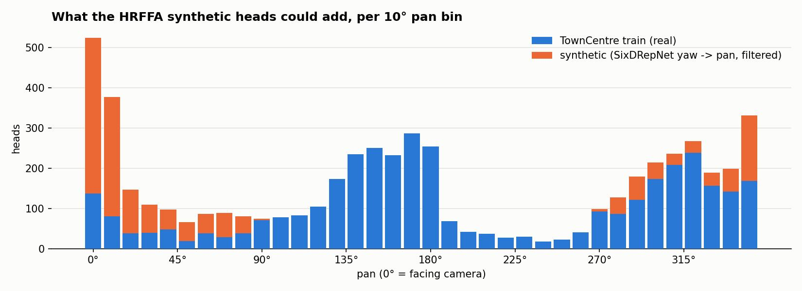
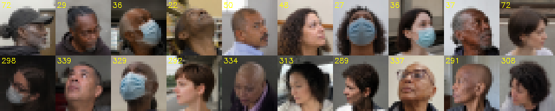

# 005: Can the HRFFA synthetic heads fill the sparse TownCentre angle bins?

Created 2026-08-30 (user request: while the ablation runs, check whether
`High-Angle_Robust_Fast_FaceAlignment/data/synthetic` and `.../synthetic_lookup` can fill the gaps in
`assets/002/angle_distribution_10deg.jpg`, using DEIMv2-Wholebody49 (class 7 = head) for cropping and
SixDRepNet360 for the yaw). Feasibility study only; nothing was trained. Scripts and raw outputs are in
`assets/005/` (`sixd_infer.py`, `synth_fill_analysis.py`, `sixd_synthetic.jsonl.gz`, `sixd_towncentre.jsonl.gz`).

## 0. Summary

- 8 000 synthetic images (5 000 + 3 000, all QA-pass, gpt-image-2, 1024-1536 px, upper-body portraits).
  They were generated for **pitch** coverage: 79 % have |yaw| < 30 deg, **no back views exist** (`reject_back`),
  and the only CCTV-like viewpoint (`camera_high`, 750 images) has |yaw| <= 23 deg.
- With SixDRepNet360 re-labelling and filtering, **1 572 heads** get a usable pan label; they land almost
  entirely in the **front half** (0 deg: 984, 45 deg: 248, 315 deg: 158, 90/270 deg: 91 each).
  **Nothing can be added to 135-225 deg**, and the 225 deg bin - the sparsest one - stays empty.
- The sparsity of 45 / 225 deg in the raw chart is already largely compensated by the p=0.5 horizontal flip
  (45 <-> 315, 225 <-> 135): the flip-effective training counts per 45 deg bin are
  `[524, 492, 300, 499, 798, 499, 300, 492]`, so the real remaining weak spots are the profiles at 90 / 270 deg
  (300 each), where the synthetic set offers only ~90 each.
- Domain gap: eye-level sharp portraits vs blurred oblique-top-down 28 px CCTV crops (`assets/005/synth_vs_tc.png`).
- Verdict: **not worth it as-is.** A small experiment (~500 heads in 20-80 / 280-340 deg, weight <= 10 %,
  judged by per-bin MAAD) is possible but the expected effect on the 443-head test set is below the epoch noise.

## 1. Tools

| Tool | Result on the synthetic set | Result on TownCentre crops |
|---|---|---|
| DEIMv2-Wholebody49 head boxes | already present in `auto_qa.jsonl` (`head_box_xyxy`, `direction`); re-detection not needed | not run (crops are already heads) |
| SixDRepNet360 (`sixdrepnet360_1x3x224x224_full.onnx`, bbox x1.2, 256 -> centre 224, ImageNet norm) | usable: sign is **opposite** to the generation-intent convention (69 % agreement after negation); median \|est - intent\| 15 deg, 24 deg for \|intent\| >= 45; never outputs \|yaw\| > 90 on this set | **unusable**: on 2 000 train crops the best circular fit pan ~ (-yaw + 170) gives MAAD 83 deg (chance = 90); outputs collapse to yaw -15 +- 15, pitch/roll std > 120 deg |

Input resolution: for the synthetic set the 224x224 network input is a *down-scaled* crop of the original
1024-1536 px image (head box ~250-400 px, expanded x1.2, resized to 256, centre 224) - the 28 px versions
shown in the montages are for the training-use discussion only and were never fed to SixDRepNet. For
TownCentre the whole ~28 px crop is *up-scaled* to 256 -> 224, which is the condition under which the model fails.

Sign / mapping (visual check, `assets/005/sign_check.png`): TownCentre pan 80-100 deg faces image-right, as do
synthetic heads with intent yaw +60..+90 (`left_side` by the detector), so **pan = intent yaw = -SixDRepNet yaw
(mod 360)**, 0 deg = facing the camera.

## 2. What could be added (usable = |est - intent| <= 25 deg, |est pitch| <= 35 deg)

| 45 deg bin | TownCentre train | flip-effective | synthetic usable |
|---|---|---|---|
| 0 | 524 | 524 | 984 |
| 45 | 156 | 492 | 248 |
| 90 | 267 | 300 | 91 |
| 135 | 865 | 499 | 0 |
| 180 | 798 | 798 | 0 |
| 225 | 132 | 499 | 0 |
| 270 | 334 | 300 | 91 |
| 315 | 828 | 492 | 158 |

Why so few profiles out of 8 000 images (per generation bin; "est" = SixDRepNet, sign corrected):

| bin | planned | intent \|yaw\| | intent \|pitch\| | est \|yaw\| median | est \|pitch\| median | est \|yaw\| >= 45 | pass filter |
|---|---|---|---|---|---|---|---|
| yaw_extreme | 500 | 62-98 | 2-28 | 73 | 20 | 497 | 268 |
| combined_pitch_yaw | 750 | 32-88 | 32-58 | 44 | 29 | 341 | 183 |
| combined_pitch_30_60_yaw_30_90 (lookup) | 300 | 32-88 | 32-58 | 42 | 50 | 76 | 17 |
| combined_pitch_60_90_yaw_30_60 (lookup) | 150 | 32-58 | 62-88 | 30 | 54 | 7 | 7 |
| all other bins (pitch / camera elevation) | 6 300 | 6-23 | 2-118 | 4-22 | 33-74 | 284 | 1 097 |

1. By design 79 % of the set has intent |yaw| < 30 deg; only `yaw_extreme` (500) asks for a level head turned
   sideways, the other large-yaw bins combine it with 32-88 deg of pitch.
2. The generator under-rotates: of the 1 050 images with intent |yaw| >= 60, the estimated |yaw| has median 56 deg;
   34 % are >= 67.5 deg (the 90 deg bin), 25 % are < 45 deg.
3. The filter (|est pitch| <= 35, |est - intent| <= 25) removes the looking-up/down composites, and the survivors
   split between the left and right sides (45 / 315, 90 / 270).

## 3. If it is tried anyway

1. Take the 1 572 usable heads, crop the `head_box_xyxy` with a 15 % margin, downscale with INTER_AREA to
   ~28 px, then apply the `cctv` photometric preset with blur/JPEG probabilities raised.
2. Write them to a manifest with `source: "synthetic"`, `angle_deg = (-sixd_yaw) mod 360`, and mix them at
   <= 10 % of the batch (sampling weight, not by count).
3. Judge only on per-bin MAAD at 45 / 315 / 90 / 270 deg (evaluation code for per-bin MAAD is still to be
   written, 004 §4); overall MAAD is expected to move by less than the +-0.4 deg noise.

## 4. Better routes for the profile bins

- Loss / sampling weights by angle density (cheap, no domain gap).
- Generate a **new** synthetic set with the HRFFA pipeline configured for this task: camera elevation 30-60 deg,
  yaw uniform over 360 deg including back views (`reject_back: false`), small heads; ~1 000 images.
- DEIMv2-Wholebody49 also outputs 8 head-direction classes (ids 8-15: Front, Right_Front, Right_Side, ...,
  Left_Front). Unlike SixDRepNet it is trained for low-resolution surveillance heads, so it may give a coarse pan
  for the 480 k unlabelled TownCentre frames; untested.
