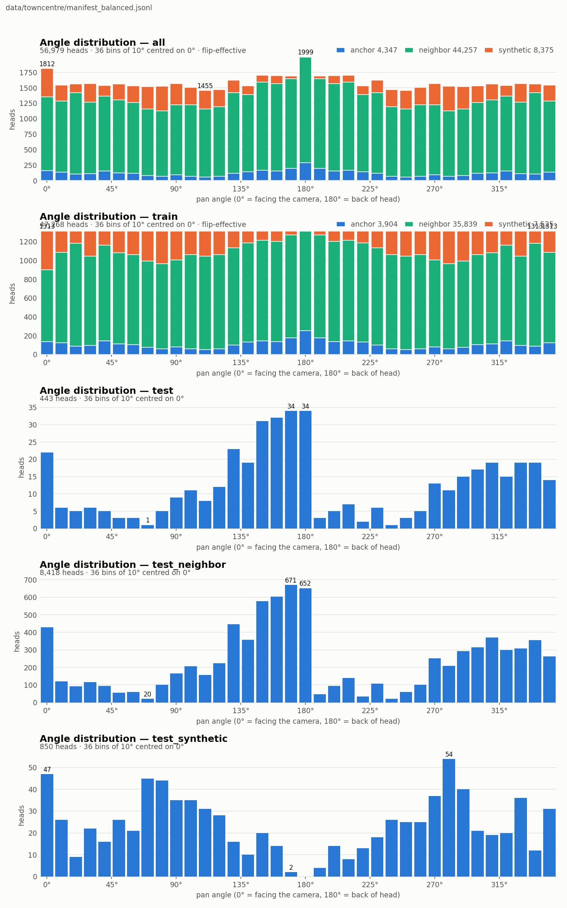
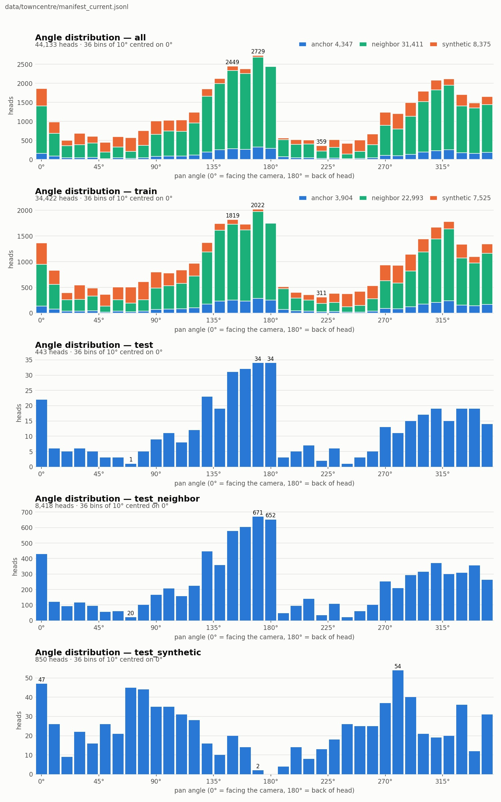
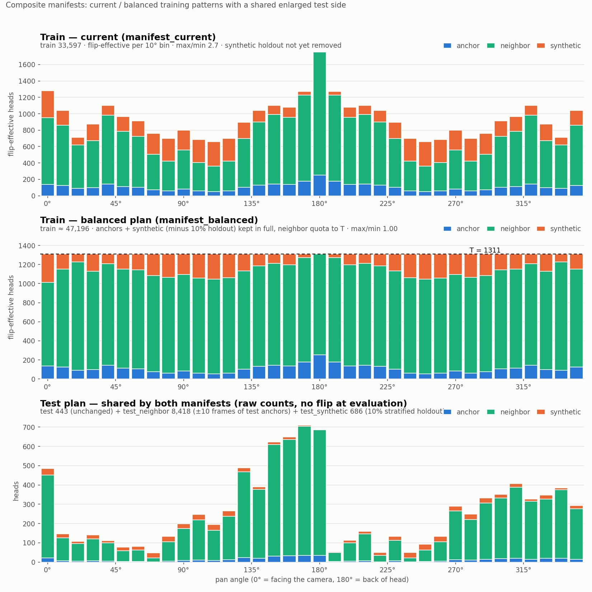

# 017: Composite manifests - current / balanced training with a shared enlarged test side

Created 2026-08-31 (user requests, in order: flatten the angle distribution by adjusting the neighbour
amount per bin while keeping all anchors and all synthetic records; make current/balanced selectable; also
allocate some data to the test side; implement). Builder: `biternionnet/balance.py`,
CLI `scripts/build_composite_manifests.py`; tests in `tests/test_balance.py`.

## 1. What is generated

`build_composite_manifests --combined data/towncentre/manifest_nb3_synthetic_all_elevations.jsonl` writes
two manifests that differ **only in train**; selection at training time is just `--manifest`:

| | train | steps/epoch | 94k-step budget |
|---|---|---|---|
| `manifest_current.jsonl` | anchors 3,904 + k=3 neighbours 22,993 + synthetic 7,525 = 34,422 | 345 | epochs 273 (const 234 + cosine 39) |
| `manifest_balanced.jsonl` | anchors 3,904 + quota neighbours 35,839 + synthetic 7,525 = 47,268 | 473 | epochs 199 (const 171 + cosine 28) |

Balanced: neighbours are re-selected per flip-effective 10-deg mirror-pair bin up to the auto target
**T = 1,313** (nearest |frame_offset| first, cap +-10, deterministic seed) - achieved effective min = max =
1,313.0 (max/min 1.00; hash-bound holdout state, see §7). Raw per-bin counts are *not* flat (the two sides of a mirror pair fill where frames
exist); what training sees under p=0.5 flips is the flip-effective count, which is flat.
`plot_angle_distribution.py --flip-effective` renders that view.

Shared test side (byte-identical in both files):

- `test` 443 - the original anchors, unchanged (comparability with all earlier runs; per-epoch eval and
  checkpoint selection keep using only this split);
- `test_neighbor` 8,418 - +-10 frames of the test anchors, same angle (correlated samples: report
  anchor-clustered errors when quoting per-bin numbers);
- `test_synthetic` 850 - a ~10 % hash-bound holdout (statistically stratified; see §7) of the synthetic set, removed from train
  in BOTH manifests (so the current/balanced pair differs only in neighbours). Domain-shifted diagnostic
  split; 87 % of synthetic labels are intent-based (see 007 review) - read `label_source` before trusting it.

## 2. Evaluation

`biternion-eval --split test_neighbor` etc.; per-45-deg-bin MAAD (`bin_XXX_maad_deg`, `bin_XXX_count`,
`bin_macro_maad_deg`) is included in every angle evaluation by `biternionnet/evaluation.py` (008), and
`--predictions-output` writes per-item rows for paired bootstraps.

## 3. Caveat carried over from the 007 review

On the original 443-head test the 90/270-deg bins have 33/42 heads (bootstrap SE ~5 deg), so per-bin
conclusions should be drawn on `test_neighbor` (n 683/961 in those sectors, correlated) or on pooled
sectors, with paired comparisons.

## 4. Runs (planned)

Same 94k-step budget, seed 0..2:

```text
A: --manifest data/towncentre/manifest_current.jsonl  --epochs 273 --decay-start-epoch 235 --cosine-epochs 39
B: --manifest data/towncentre/manifest_balanced.jsonl --epochs 199 --decay-start-epoch 172 --cosine-epochs 28
(both: towncentre-biternion-vonmises + plateau_cosine --disable-plateau-trigger --photometric cctv --scale-jitter 0.9 1.1)
```

Judge on: overall `maad_deg` on `test` (guard), `bin_macro_maad_deg` and the profile bins on `test` and
`test_neighbor`. Expectation: balanced trades a little overall MAAD (the test set stays bimodal) for better
profile bins.

## 5. Figures





## 6. Update 2026-08-31 (second synthetic batch)

`production-mask20-v002-edit01-crop` added 1,675 synthetic heads (front / profile bands 0/45/90/270/315,
label_source sixdrepnet360 358 / intent 1,317; masked-face variants). Regenerated with the same command:
synthetic 8,375 -> holdout 855, synthetic_train 7,520; current train 34,417 (345 steps/epoch, budget
273/234/39); balanced train unchanged at 47,196 - the extra synthetic displaces neighbour quota
(35,772, was 37,278) and the auto target stays **T = 1,311** (still limited by the 110-deg pair's
neighbour availability). Test side: `test` and `test_neighbor` unchanged; `test_synthetic` grew 686 -> 855,
so results on it are not comparable with evaluations made before this update.

## 7. Hash-bound holdout (2026-08-31)

The `test_synthetic` holdout selection changed from per-bin random sampling to a **crc32(custom_id) hash
gate** (HRFFA-style, salted by `--seed`): a synthetic record's train/holdout membership is now stable when
later batches are added (the previous scheme reshuffled it - the uniform200 holdout changed 686 -> 679 when
the mask20 batch arrived, which would leak train images of older models into a re-generated test_synthetic).
Stratification per bin is now statistical rather than exact. This regeneration reshuffles membership one last
time; evaluations on test_synthetic made before it are void.

## 8. First balanced result (2026-08-31, swish arm)

Run `runs/synth-biternion-vonmises-swish` (earlier names: syn-balanced-swish, towncentre-biternion-vonmises-swish): `towncentre-biternion-vonmises` on `manifest_balanced.jsonl`, seed 0,
`--epochs 350 --decay-start-epoch 301 --cosine-epochs 50` (= 165,550 steps, 1.76x the 94k reference
budget), `--photometric cctv --scale-jitter 0.9 1.1 --backbone-activation swish`.

| metric (test, 443) | R4-long reference (nb3, relu, 94k) | syn-balanced-swish |
|---|---|---|
| MAAD last-7-epoch | 18.80 +- 0.33 | **18.32 +- 0.12** |
| final epoch | 18.92 | 18.55 |
| bin_macro | ~20.9 | **18.80** |
| bin 225 / 90 | 38.2 / 26.6 | **23.7 / 20.0** |
| bin 0 / 180 | 16.5 / 18.4 | 17.6 / 21.8 |

The flattening works as intended: the rare bins improve by 6-14 deg, the dominant bins give back 1-3 deg,
and the overall MAAD still improves. Donut heatmaps (`scripts/plot_donut.py`, split test_neighbor) show a
continuous prediction ring with no dead sectors. Caveats: three factors changed at once vs the reference
(balanced manifest + larger budget + swish), and the bin_macro gain (~2 deg) is at the edge of the per-bin
noise floor (007 review) - the relu arm on the same command (minus `--backbone-activation swish`) and/or
extra seeds are needed before adopting balanced as the default.

## 9. Both arms complete (2026-08-31): relu vs swish, and test_neighbor corrects the picture

`runs/synth-biternion-vonmises-relu` = §8's command minus `--backbone-activation swish`; everything else
identical (balanced manifest, seed 0, 350 ep / cosine 50 = 165,550 steps).

test (443):

| run | last7 MAAD | final | bin_macro | 90 | 225 |
|---|---|---|---|---|---|
| balanced relu | 19.01 +- 0.15 | 18.94 | 20.48 | 25.9 | 34.1 |
| balanced swish | 18.32 +- 0.12 | 18.55 | 18.80 | 20.0 | 23.7 |

test_neighbor (8,418; the reliable split for per-bin reads):

| run | MAAD | bin_macro | 0 | 45 | 90 | 135 | 180 | 225 | 270 | 315 |
|---|---|---|---|---|---|---|---|---|---|---|
| R4-long (nb3, relu, 94k) | 20.82 | 22.93 | 19.0 | 16.6 | 28.4 | 20.2 | 19.6 | 38.9 | 24.5 | 16.3 |
| balanced relu (165k) | 21.44 | 23.26 | 20.7 | 18.7 | 24.3 | 19.3 | 22.2 | 40.2 | 22.2 | 18.6 |
| balanced swish (165k) | 20.74 | 22.48 | 20.7 | 18.6 | 24.1 | 18.8 | 21.6 | 37.0 | 22.4 | 16.5 |

Findings (seed 0 only):

1. **Swish > relu, consistently**: -0.69 deg on test, -0.70 on test_neighbor, macro -0.8; the only factor that
   moves both splits the same way.
2. **The dramatic §8 rare-bin gains were small-n noise**, as the 007 review predicted: on test the 225-deg bin
   (n=17) improved 38 -> 24, but on test_neighbor (n=320) it is 38.9 -> 37.0. The real effect of
   balanced + synthetic is ~-4 deg at 90 deg, ~-2 deg at 225 (swish), paid for with +1-2 deg at 0/180.
3. **Balanced + synthetic does not beat the nb3 reference overall** on test_neighbor (20.74 vs 20.82 at 1.76x
   the budget); it redistributes error from profiles to the dominant sectors, macro -0.45.

Next: seeds 1-2 for the swish pair, and a swish run on the nb3 manifest to separate "swish alone" from
"swish + balanced"; per-item paired bootstrap (`--predictions-output`) for the 90/225 sectors.

## 10. Current-pattern swish arm (2026-08-31): the flattening effect isolated

`runs/synth-current-biternion-vonmises-swish`: same command as the balanced swish arm but on
`manifest_current.jsonl` (345 steps/epoch -> 120,750 steps vs 165,550; the budget difference is
minor given the flat constant phase, but noted).

| swish arms | test last7 | test macro | test_nb MAAD | test_nb macro | test_nb 90 | test_nb 270 | test_nb 225 |
|---|---|---|---|---|---|---|---|
| current (121k) | **18.11 +- 0.10** | 19.31 | 21.24 | 23.29 | 26.4 | 25.2 | 37.4 |
| balanced (165k) | 18.32 +- 0.12 | **18.80** | **20.74** | **22.48** | **24.1** | **22.4** | 37.0 |

Balanced vs current with everything else equal: the flattening buys **-2.3 deg at 90, -2.8 at 270,
-0.8 macro on test_neighbor**, and costs 0.2 deg on the bimodal 443-head test. The 225-deg sector
(back-left profile, where the synthetic set has no measured labels) stays hard for every model (~37-40).

Cross-run picture on test_neighbor: R4-long (nb3, relu, 94k) 20.82 / macro 22.93; current-swish 21.24 /
23.29; balanced-swish 20.74 / 22.48. I.e. adding the synthetic set without flattening did not help the
enlarged test; flattening + swish is the only combination that improves both macro and the profile bins
over the nb3 reference.

**Working default going forward: balanced manifest + swish** (best macro and profile bins, negligible
cost on test). Open items: seeds 1-2, the 225-deg sector (needs measured rear labels or real data), and
the resize-46 ablation (004 §3.1.1).

## 11. Current with capped peaks (2026-08-31)

The 0/180-deg bins are their own flip mirrors, so unlike every other bin their raw counts are not
averaged with a sparse opposite side; with the x6.9 neighbour expansion this makes the 175-185 deg
exposure ~1.6x its surroundings in the current pattern (raw anchors there are not even the maximum -
bin 170 has 287 vs 254). `--current-cap-effective` writes a third manifest,
`manifest_current_capped.jsonl`, that trims **only neighbour records** (farthest |frame_offset| first,
deterministic) of bins whose flip-effective count exceeds the ceiling; `-1` = auto (the highest
non-self-mirrored pair). Anchors, synthetic and the shared test side are untouched;
`manifest_current` / `manifest_balanced` stay byte-identical.

Real numbers: cap 1,267.5 -> bins 0/180 come down from 1,796 / 1,997 to 1,267 / 1,268 by dropping 580
of 22,993 neighbours; train 33,842 (339 steps/epoch; same 350/301/50 command applies). The rest of the
distribution is unchanged (min bin still 630), so this sits between current (as-is) and balanced (flat).

Numeric variant iterations (user request): first 1,100, then 900 and 700, then **600 adopted**. `--current-cap-effective 1100` trims every bin above 1,100
(bins 0 / 40 / 170-pair / 180 hit the ceiling; 1,318 of 22,993 neighbours dropped). Train 33,104
(332 steps/epoch), effective range 630..1,100 (max/min 1.75 vs 2.7 current / 1.0 balanced).
At 900: 13 of the 19 mirror-pair bins sit at the ceiling (0-10, 30-60, 140-180 and their mirrors),
4,325 of 22,993 neighbours dropped, train 30,097 (301 steps/epoch), effective range 630..900
(max/min 1.43) - approaching the balanced shape from above, with the sub-ceiling bins untouched.
At 700: 16 of 19 pair bins at the ceiling (only 100/110/120 deg stay below: 656/630/672), 9,503 of
22,993 neighbours dropped, train 24,919 (250 steps/epoch), max/min 1.11 - effectively a "balanced-lite"
at T=700 that *discards* data, where the balanced manifest reaches the same flatness at T=1,313 by
*adding* neighbours. Below ~650 the cap cannot flatten further (the valley bins have no surplus to trim).
At 600 every bin can be trimmed to the ceiling: fully flat (max/min 1.00) at T=600, 12,822 of 22,993
neighbours dropped, train 21,600 (216 steps/epoch) - the same shape as the balanced manifest with 2.2x
less data per bin, which makes the balanced-vs-capped-600 pair a clean flatness-vs-data-volume ablation.

## 12. Flatness vs data volume resolved (2026-08-31, capped600 swish arm)

`runs/synth-capped600-biternion-vonmises-swish`: `manifest_capped600.jsonl` (flat at T=600 by trimming),
same command family (350/301/50, swish, no label jitter), 75,600 steps.

test_neighbor (swish arms):

| | steps | MAAD | macro | 45 | 90 | 225 | 270 |
|---|---|---|---|---|---|---|---|
| current (peaked) | 121k | 21.24 | 23.29 | 19.3 | 26.4 | 37.4 | 25.2 |
| capped600 (flat, T=600) | 76k | 20.88 | 22.77 | **16.6** | 27.2 | 38.3 | 23.6 |
| capped600 + label jitter 1.5 | 76k | 20.81 | 22.57 | 15.7 | 28.3 | 37.7 | 22.0 |
| balanced (flat, T=1,313) | 165k | **20.74** | **22.48** | 18.6 | **24.1** | 37.0 | **22.4** |

test: capped600 18.63 +- 0.23 / macro 19.90; with `--neighbor-label-jitter 1.5` 18.32 +- 0.06 / 20.01
(balanced 18.32 / 18.80; current 18.11 / 19.31).

Reading:

- **Flatness alone recovers most of the overall gain**: capped600 matches balanced's test_neighbor MAAD
  to within noise (20.88 vs 20.74) with 2.2x less data per bin and 46 % of the steps.
- **The profile-bin gains need the extra data, not just the shape**: at 90 deg capped600 (27.2) is even
  worse than current (26.4) - capping *removed* valley-bin records - while balanced's unique +-10-frame
  fillings bring it to 24.1. Same direction at 270 deg.
- Working default stays **balanced + swish**; capped600 is the budget option when training cost matters
  more than the profile bins.
